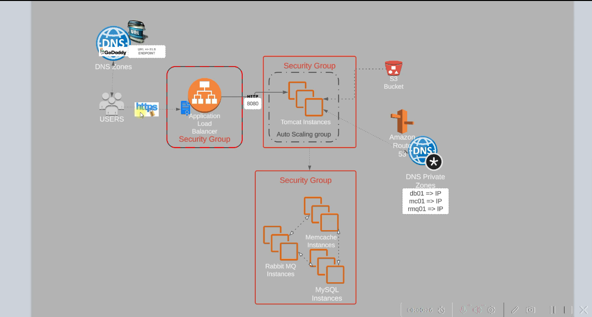

# Prerequisites
#
- JDK 17 or 21
- Maven 3.9
- MySQL 8

# Technologies 
- Spring MVC
- Spring Security
- Spring Data JPA
- Maven
- JSP
- Tomcat
- MySQL
- Memcached
- Rabbitmq
- ElasticSearch
# Database
Here,we used Mysql DB 
sql dump file:
- /src/main/resources/db_backup.sql
- db_backup.sql file is a mysql dump file.we have to import this dump to mysql db server
- > mysql -u <user_name> -p accounts < db_backup.sql


* In cloud, use ALB instead of nginx as frontend and ec2 instances (amazon linux 2023 AMI) for other services. Othr cloud services are also used like r53, auto-scaling for tomcat, s3, aws certificate manager to allow only https 

- 3 security groups
    * ALB
    * tomcat
    * backend
- user request to ALB on 443 or 80 if not using certificate
- ALB to tomcat on 8080 (also a rule to allow client IP on 8080)
- Tomcat to backend
    * MySql on 3306
    * RabbitMQ on 5672
    * Memecache on 11211
    * these ports are in src/main/resources/application.properties (also need to update the host names of servers with DNS name, can use private DNS zone)
- allow all within the backend
- Also port 22 to ssh the above services




* After setting up the servers and DNS records
    - create s3 bucket to store the artifacts (if required create IAM user and attach s3 full access policy which can be used for aws configure)
    - create an IAM role for ec2 service and attach s3 full access policy....... assign this role to tomcat server --> Actions --> security --> manage IAM role
    - use Maven to build the application artifact
        * before building, make sure to update the host details in src/main/resources/application.properties file with the DNS names or private IPs
        * In VS code, press 'ctrl+shift+P' and type 'select Default profile' and select the terminal (Gitbash or preferred one). Check if maven is installed (mvn -version), if not need to install JDK and maven (follow the installing softwares lecture)
        * after checking/installing maven, change the working directory to the one where 'pom.xml' exist and run the below command to build which will create 'target' folder having the artifact (.war file) 
        ```
        mvn install
        ```
    - push the artifacts to s3 bucket using aws cli
        * connect to aws
            ```
            aws configure
            ```
            Note: if need to modify access key or access Id of 'aws configure' can edit using the command in gitbash
            ```
            vim ~/.aws/credentials
            ```
            to edit the region and output format
            ```
            vim ~/.aws/config
            ```
            * push the artifact to s3 bucket
            ```
            aws s3 <path of .war file> s3://<bucketname>
            ```
            - to push into a sub folder in the bucket
            ```
            aws s3 <path of .war file> s3://<bucket name>/<folder name>
            ```
            - to list the bucket content
            ```
            aws s3 ls s3://<bucket name>/<folder name>
            ```
    - Login to app server and fetch the artifact from s3 bucket
        * can use 'apt' command on ubuntu to install a package but can also use 'snap' package manager. The below command installs aws cli on the app server
        ```
        snap install aws-cli --classic
        ```
        * copy the artifact from s3 bucket (no need for aws configure as the app server has the IAM role assigned in earlier steps to use s3)
        ```
        aws s3 cp s3://<bucket name>/<folder name>/<artifact name> <destination>
        ```
            assuming no sub folder in the s3 bucket

            eg: aws s3 cp s3://vprofile-project/vprofile-v2.war /tmp/


            if there is any sub folder

            eg: aws s3 cp s3://vprofile-project/artifact-folder/vprofile-v2.war /tmp/
        
        * deploy the artifact
            - first stop the tomcat service
            ```
            systemctl stop tomcat<version>
            ```
            if any warning of change in source configuration....
            ```
            systemctl daemon-reload
            ```
            ```
           systemctl stop tomcat<version>
           ```
           - remove the default application (ROOT folder) in tomcat at below path (ubuntu)

           ```
           ls /var/lib/tomcat<versoin>/webapps/
           ```    
           ```
           rm -rf /var/lib/tomcat<versoin>/webapps/ROOT
           ```

           - Copy the artifact 
           ```
           cp /tmp/<artifact-file.war> /var/lib/tomcat<versoin>/webapps/ROOT.war
           ```

           - start the tomcat service which will extract the ROOT.war file
           ```
           systemctl start tomcat<version>
           ```

* Setting up load balancer
    - create a target group of type 'instances'
        * select protocol HTTP and port 8080 (for tomcat) also in health check ---> advanced setting ---> health check port --> override --> 8080 ---> next --> select the app server instance and port 8080 --> click 'include as pendin below' --> create target group
    - Create a certificate for the domain in ACM (aws certificate manager) to use HTTPS port for ALB
    - Create ALB and add CNAME record for its endpoint (u&p -- admin_vp)
        * use its endpoint for HTTP
        * use DNS name for HTTPS

* To auto scale the app instance
    - create AMI for app server --> actions --> image and templates --> create image
    - create a launch template to be used for auto scaling group
        * select the snapshot AMI, instnace type, security group
        * under advanced details --> select IAM role created for app server (s3 full access), useful in CI/CD
    - create auto scaling group
    - in the target group --> attributes --> edit --> turn on stickiness (required for vprofile application, without this if the request is directed to another instance on subsequent access it will ask to login again)


